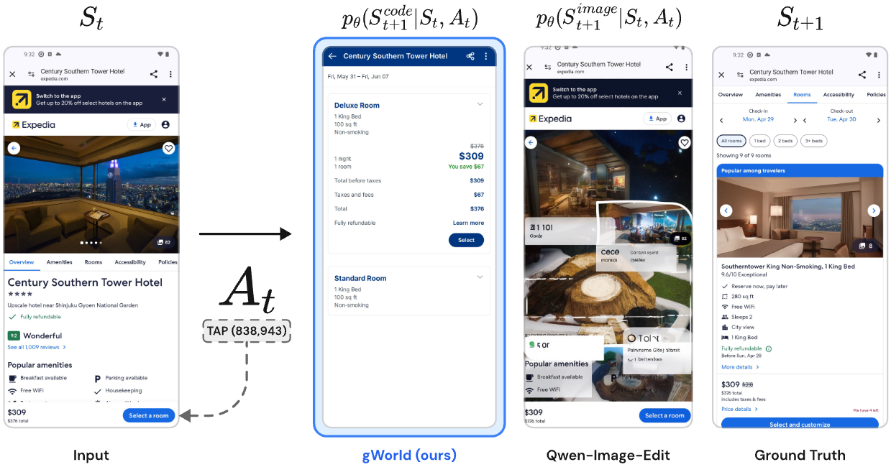
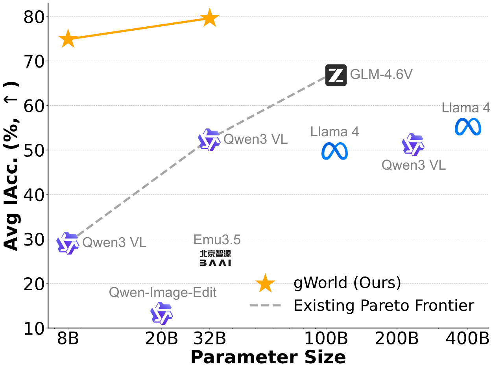
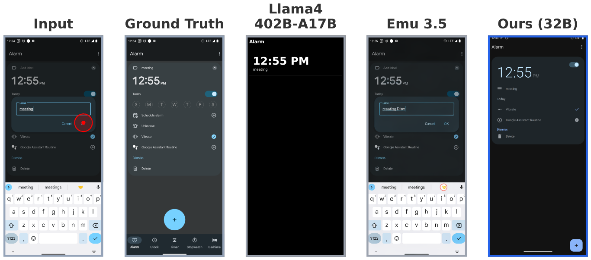

# gWorld

**Generative Visual Code Mobile World Model**

gWorld is the first open-weight, single self-contained Vision-Language Model (VLM) specialized for visual mobile GUI world modeling. It predicts the next GUI state as executable web code rather than generating pixels directly. Available in two sizes: **gWorld-8B** and **gWorld-32B**.



## Key Features

- **Action-conditioned next-state prediction** for mobile GUIs
- **Pixel-perfect text rendering** and structurally accurate layouts
- **Code-based generation** overcomes hallucination and legibility issues of pixel-generation models
- **Fast rendering** (~0.3s via Playwright, faster than multi-step diffusion pipelines)
- **Low failure rate** (<1% render failure rate)

## Model Variants

| Property | gWorld-8B | gWorld-32B |
|----------|-----------|------------|
| Base Model | Qwen/Qwen3-VL-8B-Instruct | Qwen/Qwen3-VL-32B |
| Parameters | 9B | 33B |
| Tensor Type | BF16 | BF16 |
| License | Apache 2.0 | Apache 2.0 |
| HuggingFace | [trillionlabs/gWorld-8B](https://huggingface.co/trillionlabs/gWorld-8B) | [trillionlabs/gWorld-32B](https://huggingface.co/trillionlabs/gWorld-32B) |

## Performance

Both models achieve state-of-the-art efficiency on mobile world modeling:

### gWorld-8B
- Outperforms frontier models up to **50.25x larger** (e.g., Llama 4 402B-A17B)
- **+45.7% gain** in Instruction Accuracy over base Qwen3-VL
- High zero-shot performance on AndroidWorld and KApps (Korean) benchmarks

### gWorld-32B
- Outperforms frontier models up to **12.6x larger** (e.g., Llama 4 402B-A17B)
- **+27.1% gain** in Instruction Accuracy over base Qwen3-VL
- High zero-shot generalization on out-of-distribution benchmarks



## Installation

```bash
pip install -r requirements.txt

# Install Playwright browsers
playwright install chromium
```

### Requirements

- Python 3.10+
- CUDA-compatible GPU (8x GPUs recommended for tensor parallelism)
- Dependencies: torch, transformers, vllm, Pillow, playwright, tqdm

## Usage

### Input Format

gWorld takes two inputs:
1. **Current screenshot** - Mobile GUI image
2. **User action** - JSON formatted action string (action types vary by benchmark)

**Coordinate Space:** Normalized [0, 1000] scale

### Output Format

The model outputs:
1. **Next State Reasoning** - Logical explanation of expected changes
2. **HTML Code** - Renderable HTML/CSS representing the next GUI state

```
# Next State Reasoning: <your reasoning about what the next state should look like>
# HTML: <valid_html_code>
```

### Inference with vLLM

```python
from vllm import LLM, SamplingParams
from transformers import AutoProcessor
from PIL import Image

# Model configuration (choose one)
# For gWorld-8B:
MODEL_PATH = "trillionlabs/gWorld-8B"
BASE_MODEL = "Qwen/Qwen3-VL-8B-Instruct"

# For gWorld-32B:
# MODEL_PATH = "trillionlabs/gWorld-32B"
# BASE_MODEL = "Qwen/Qwen3-VL-32B"

# Image processing settings
MM_PROCESSOR_KWARGS = {
    "max_pixels": 4233600,
    "min_pixels": 3136,
}

# Load model
llm = LLM(
    model=MODEL_PATH,
    tokenizer=BASE_MODEL,
    tensor_parallel_size=8,
    gpu_memory_utilization=0.9,
    max_model_len=19384,
    trust_remote_code=True,
    mm_processor_kwargs=MM_PROCESSOR_KWARGS,
    enable_chunked_prefill=True,
    max_num_batched_tokens=16384,
)

# Load processor for chat template
processor = AutoProcessor.from_pretrained(BASE_MODEL, trust_remote_code=True)

# Prepare input
image = Image.open("screenshot.png")
if image.mode != 'RGB':
    image = image.convert('RGB')

action = '{"action_type": "TAP", "coordinates": [512, 890]}'

# World model prompt template
user_content = f"""You are an expert mobile UI World Model that can accurately predict the next state given an action.
Given a screenshot of a mobile interface and an action, you must generate clean, responsive HTML code that represents the state of the interface AFTER the action is performed.
First generate reasoning about what the next state should look like based on the action.
Afterwards, generate the HTML code representing the next state that logically follows the action.
You will render this HTML in a mobile viewport to see how similar it looks and acts like the mobile screenshot.

Requirements:
1. Provide reasoning about what the next state should look like based on the action
2. Generate complete, valid HTML5 code
3. Choose between using inline CSS and utility classes from Bootstrap, Tailwind CSS, or MUI for styling, depending on which option generates the closest code to the screenshot.
4. Use mobile-first design principles matching screenshot dimensions.
5. For images, use inline SVG placeholders with explicit width and height attributes that match the approximate dimensions from the screenshot. Matching the approximate color is also good.
6. Use modern web standards and best practices
7. Return ONLY the HTML code, no explanations or markdown formatting
8. The generated HTML should render properly in a mobile viewport.
9. Generated HTML should look like the screen that logically follows the current screen and the action.

Action:
{action}

Output format:
# Next State Reasoning: <your reasoning about what the next state should look like>
# HTML: <valid_html_code>

Generate the next state reasoning and the next state in html:"""

# Build messages
messages = [
    {
        "role": "user",
        "content": [
            {"type": "image", "image": image},
            {"type": "text", "text": user_content},
        ],
    }
]

# Apply chat template
prompt = processor.apply_chat_template(
    messages,
    tokenize=False,
    add_generation_prompt=True,
)

# Generation parameters
sampling_params = SamplingParams(
    max_tokens=15000,
    temperature=0,
    seed=42,
    top_p=1.0,
)

# Generate
outputs = llm.generate(
    [{"prompt": prompt, "multi_modal_data": {"image": image}}],
    sampling_params=sampling_params
)

print(outputs[0].outputs[0].text)
```

### Rendering HTML Output

Use Playwright to render the generated HTML with proper viewport scaling:

```python
from playwright.sync_api import sync_playwright
from PIL import Image

def get_scale_factor_for_size(ref_width: int, ref_height: int) -> float:
    """Get appropriate scale factor for given image dimensions."""
    size_to_scale = {
        (1080, 2400): 3.0,
        (1440, 3120): 4.0,
        (1440, 3040): 4.0,
        (720, 1280): 2.0,
        (1344, 2992): 3.0,
        (1440, 2960): 4.0,
        (1080, 2280): 3.0,
        (1080, 2160): 3.0,
        (2560, 1600): 2.0,
        (1600, 2560): 2.0,
    }

    if (ref_width, ref_height) in size_to_scale:
        return size_to_scale[(ref_width, ref_height)]

    # Default heuristic for portrait/landscape
    is_portrait = ref_height > ref_width
    if is_portrait:
        for scale in [4.0, 3.0, 2.5, 2.0, 1.5]:
            logical_w = int(ref_width / scale)
            logical_h = int(ref_height / scale)
            if 300 <= logical_w <= 500 and 500 <= logical_h <= 1200:
                return scale
    else:
        for scale in [2.0, 1.5, 3.0]:
            logical_w = int(ref_width / scale)
            logical_h = int(ref_height / scale)
            if 600 <= logical_w <= 1200 and 400 <= logical_h <= 800:
                return scale

    return 2.0

def render_html(html_code: str, reference_image_path: str, output_path: str):
    """Render HTML to image matching reference image dimensions."""
    # Get reference image dimensions
    ref_img = Image.open(reference_image_path)
    ref_width, ref_height = ref_img.size

    # Calculate viewport size
    scale_factor = get_scale_factor_for_size(ref_width, ref_height)
    viewport_width = int(ref_width / scale_factor)
    viewport_height = int(ref_height / scale_factor)

    with sync_playwright() as p:
        browser = p.chromium.launch(headless=True)
        context = browser.new_context(
            viewport={'width': viewport_width, 'height': viewport_height},
            device_scale_factor=scale_factor
        )
        page = context.new_page()
        page.set_content(html_code)
        page.wait_for_load_state('networkidle')
        page.screenshot(path=output_path, full_page=False)
        browser.close()
```

### Configuration Reference

| Parameter | gWorld-8B | gWorld-32B |
|-----------|-----------|------------|
| `tensor_parallel_size` | 8 | 8 |
| `gpu_memory_utilization` | 0.9 | 0.9 |
| `max_model_len` | 19384 | 19384 |
| `max_tokens` | 15000 | 15000 |
| `temperature` | 0 | 0 |
| `top_p` | 1.0 | 1.0 |
| `max_pixels` | 4233600 | 4233600 |
| `min_pixels` | 3136 | 3136 |

## Evaluation

Evaluation scripts are provided in `src/`:

```bash
# Evaluate on AndroidWorld benchmark
python src/eval_androidworld.py

# Evaluate on KApps (Korean) benchmark
python src/eval_kapps.py

# Evaluate on test splits
python src/eval_test_splits.py
```

## Examples



## Citation

```bibtex
@misc{koh2026generativevisualcodemobile,
      title={Generative Visual Code Mobile World Models},
      author={Woosung Koh and Sungjun Han and Segyu Lee and Se-Young Yun and Jamin Shin},
      year={2026},
      eprint={2602.01576},
      archivePrefix={arXiv},
      primaryClass={cs.LG},
      url={https://arxiv.org/abs/2602.01576},
}
```

## Resources

- [Paper](https://arxiv.org/abs/2602.01576) <!-- TODO: Update with actual arXiv link -->
- [gWorld-8B on Hugging Face](https://huggingface.co/trillionlabs/gWorld-8B)
- [gWorld-32B on Hugging Face](https://huggingface.co/trillionlabs/gWorld-32B)
- [GitHub Repository](https://github.com/trillion-labs/gWorld)

## License

Apache License 2.0
